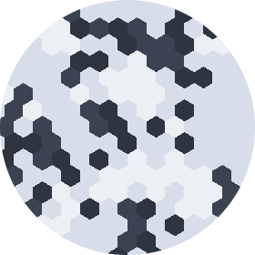

<div align="center">
  
</div>

# Hexagonal Game of Life

Conway's Game of Life on a hexagonal grid.


## How to Use

### Requirements

This program requires **Python 3.6**.  
All other requirements are listed in _requirements.txt_ and can be installed with Pip:

```
pip install -r requirements.txt
```

### Configuration and Start

#### General Settings

General settings can be found in _game.py_. The following attributes are available:

- `RULE_CONFIGURATION`: Regulations for cell birth and death.
- `GRID_CONFIGURATION`: Cell radius, grid size and grid cropping
- `COLOR_CONFIGURATION`: Color palette settings
- `SPEED`: Transition speed of gif frames

#### Game

A new game can be started by calling the `play()` method of a `Game` instance.

The `Game` constructor takes up to two parameters:

- `seed`: a 2 dimensional boolean array
- `ticks`: number of produced generations

Executing _game.py_ will start a default game:

```
python game.py
```

### Output

Generated _.gif_ files are saved as _'game.gif'_ in the main program folder.
